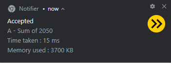
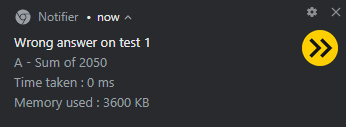
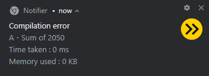
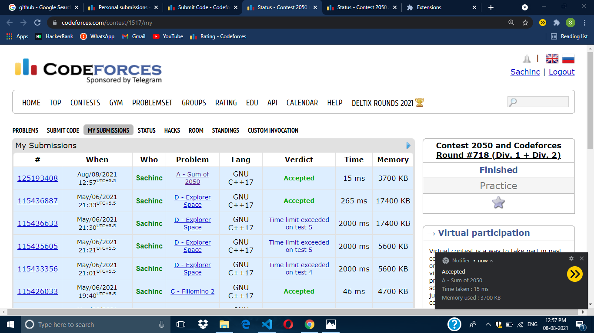

# Notifier 

## Description :

### Codeforces is a very common platform used by many aspiring coders to improve their coding skills. Often during the contest , its servers are so overloaded that our submission take a long time to get verified by the judge and our time is wasted in checking for result again and again. This extension aims to save this time by automating the process of fetching the result and informing you as soon as the result is available so that you can move on to solve the next question and not worry about whether the result has been passed by the judge or not.

## Tools used :

### Javascript , Chrome Developer Tools

## Objective :
### Create a browser extension that will automatically catch the unique ID of the submissions made to the problems on Codeforces and check the verdict of the judge on that submissionand notify the user through desktop notification once the verdict is available

## Expected Outcome :

## Accepted

## Wrong Answer

## Compilation error

## Submission page

